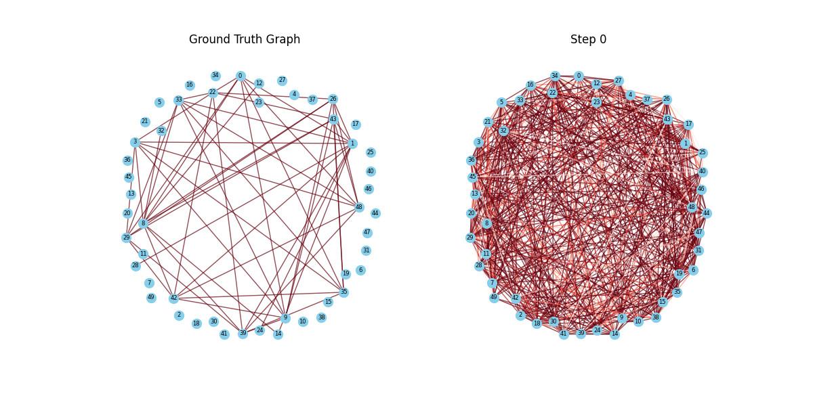

# **FlavorDiffusion**

**FlavorDiffusion** is a **diffusion-based graph restoration framework** designed to enhance **food-chemical interaction modeling** by leveraging **Denoising Diffusion Probabilistic Models (DDPMs)**. It refines node relationships in food graphs, improving **structural information embedding** and addressing **biased node sampling** issues observed in **random walk-based sampling** (e.g., FlavorGraph).

This project has significant applications in **computational gastronomy**, including **novel ingredient pairing prediction, AI-driven recipe recommendation, and predictive flavor chemistry**.

---

## **Table of Contents**

- [Key Features](#key-features)
- [Installation](#installation)
- [Dataset Construction & Sampling](#dataset-construction--sampling)
- [Usage](#usage)
- [Visualization](#visualization)
- [Experimental Results](#experimental-results)
- [Future Directions](#future-directions)
- [License](#license)

---

## **Key Features**

- **Graph-Based Diffusion Model**: Implements **Gaussian-based DDPMs** for **graph restoration and embedding refinement**.
- **Optimized Graph Network**: Inspired by **Difusco**, leveraging advanced **GNN-based diffusion mechanisms**.
- **Subgraph Sampling Strategy**: Dynamically samples subgraphs of varying sizes, preventing node imbalance issues.
- **Chemical Structure Prediction (CSP) Layer**: Enhances **embedding robustness** through **molecular property constraints**.

---

## **Installation**

```bash
# Clone the repository
git clone https://github.com/Giventicket/FlavorDiffusion.git
cd FlavorDiffusion

# Install dependencies
pip install -r requirements.txt
```

---

## **Dataset Construction & Sampling**

FlavorDiffusion extends **FlavorGraph** ([GitHub](https://github.com/lamypark/FlavorGraph)) and refines its data sampling methodology. The dataset consists of **structured subgraph sampling** for **training, validation, and testing**, using different seeds (**1, 2, 3** respectively).

### **Dataset Composition**

| Nodes per Subgraph | Train Set | Validation Set | Test Set |
|--------------------|-----------|---------------|----------|
| 25 | 256,000 | 256 | 256 |
| 50 | 128,000 | 128 | 128 |
| 100 | 64,000 | 64 | 64 |
| 200 | 32,000 | 32 | 32 |

- **Subgraph Sampling Strategy:** Implemented in `make_dataset.py`.
- **Seed Assignments:**
  - **Training:** Seed **1**
  - **Validation:** Seed **2**
  - **Testing:** Seed **3**

---

## **Usage**

### **Run Training**
```bash
# Train FlavorDiffusion on 100-node subgraphs
bash runs/run_train_100.sh
```

### **Run Evaluation & Visualization**
```bash
# Generate evaluation metrics & plots
bash runs/run_plot_and_eval.sh
```

---

## **Visualization**

### **Diffusion Process**
#### **Diffusion Animation**


#### **Diffusion Steps Comparison**


#### **HTML Visualization**
For additional interactive visualizations, open [FlavorDiffusion.html](FlavorDiffusion.html).

---

## **Experimental Results**

The **performance of FlavorDiffusion** is benchmarked against **FlavorGraph** using **Normalized Mutual Information (NMI) scores**.

| **Model**                          | **NMI Mean** | **NMI Std** |
|-------------------------------------|--------------|-------------|
| FlavorGraph (w/o CSP layer)         | 0.2995       | 0.0403      |
| FlavorGraph (w/ CSP layer)          | 0.3102       | 0.0407      |
| **FlavorDiffusion (25 nodes)**      | **0.3152**   | **0.0178**  |
| **FlavorDiffusion (50 nodes)**      | **0.3160**   | **0.0221**  |
| **FlavorDiffusion (100 nodes)**     | 0.2886       | 0.0245      |
| **FlavorDiffusion (200 nodes)**     | 0.2977       | 0.0295      |

### **Key Observations:**
- **FlavorDiffusion outperforms FlavorGraph in smaller graphs (25, 50 nodes).**
- **CSP layer enhances clustering performance**, particularly for **smaller subgraphs**.
- **Performance in larger graphs (100, 200 nodes) remains a key area for optimization**.

---

## **Future Directions**

### **Potential Applications**
- **AI-Driven Recipe Recommendation:** Predicts ingredient pairings based on **food-chemical embeddings**.
- **Food Innovation & Computational Gastronomy:** Facilitates discovery of **novel ingredient combinations**.
- **Ingredient Substitution & Reformulation:** Provides **data-driven ingredient alternatives** for **healthier recipes**.

### **Research Roadmap**
- **Improve scalability for large graphs (100+ nodes).**
- **Incorporate advanced chemical property-based embeddings.**
- **Expand dataset coverage with multimodal learning (text, images, sensory data).**

---

## **License**

This project is licensed under the MIT License. See the LICENSE file for details.

---

## **Citation**
If you use **FlavorDiffusion** in your research, please cite:
```bibtex
@article{FlavorDiffusion2025,
  author = {Seo, Junpyo and Kim, Dongwan and Jeong, Jaewook and Park, Ingyu and Min, Junho},
  title = {FlavorDiffusion: Modeling Food-Chemical Interactions with Diffusion},
  workshop = {First Workshop on AI and Scientific Discovery: Directions and Opportunities},
  year = {2025},
  url = {https://github.com/Giventicket/FlavorDiffusion}
}
```

---

**For more details, check our full research paper**: [FlavorDiffusion Research Paper](https://github.com/Giventicket/FlavorDiffusion).

